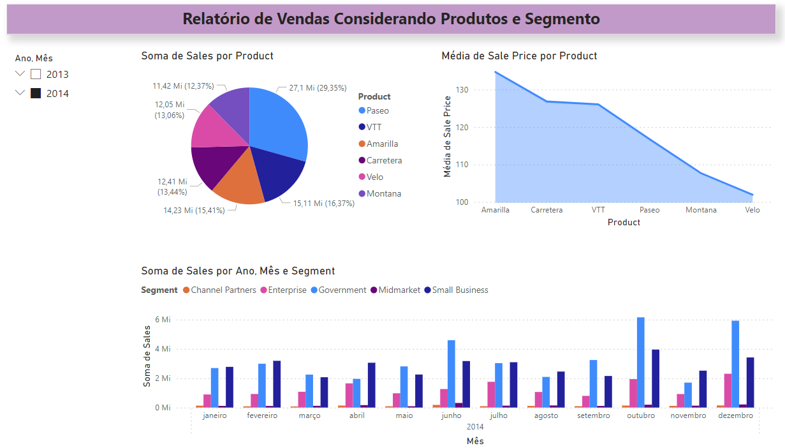
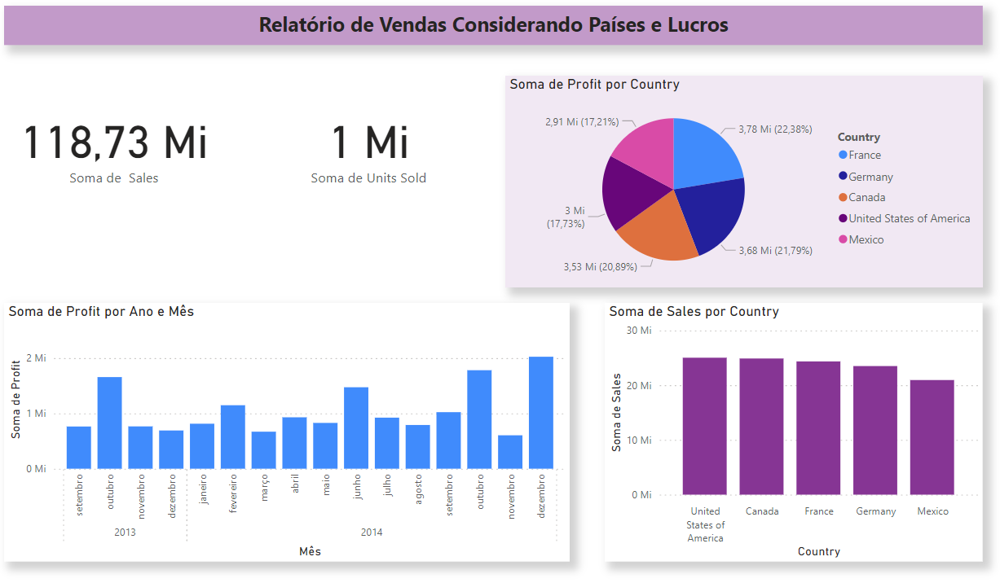
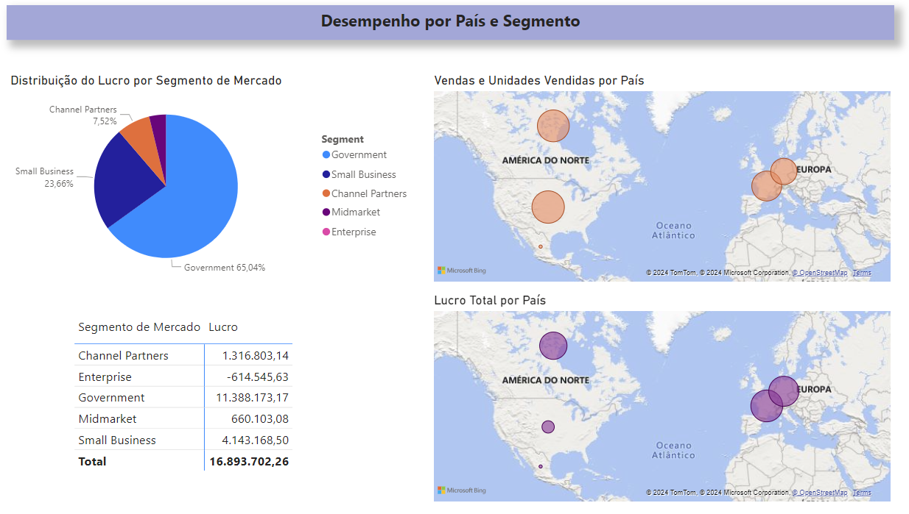

## Desafio #1 da DIO: Compreendendo o Desafio 🚀👩‍💻

**Descrição do Desafio:** 💡
O objetivo deste desafio é replicar duas páginas previamente desenvolvidas durante o curso, utilizando a amostra fornecida.

### Página 1 Recriada 📊
A primeira página deve apresentar os seguintes elementos:
- **Título do Relatório:** Deve ser claro e refletir o conteúdo da página.
- **Filtro por Ano e Mês:** 📅 Permitir que os usuários filtrem os dados conforme necessário.
- **Gráfico de Vendas por Produto:** 📈 Exibir a soma total de vendas para cada produto.
- **Gráfico do Preço Médio de Venda por Produto:** 💲 Mostrar o preço médio de venda, proporcionando insights sobre a estratégia de precificação.
- **Gráfico de Vendas por Ano, Mês e Segmento:** 📆 Oferecer uma visão detalhada das vendas, segmentadas por tempo e categoria.

### Página 2 Recriada 📉
A segunda página deve incluir:
- **Título do Relatório:** Assim como na primeira página, o título deve ser descritivo.
- **Cards de Sumário de Vendas:** 💳 Apresentar a soma das vendas e das unidades vendidas de forma destacada.
- **Gráfico de Lucro por País:** 🌍 Ilustrar a soma do lucro gerado em diferentes países.
- **Gráfico de Lucro por Ano e Mês:** 🗓️ Analisar a evolução do lucro ao longo do tempo.
- **Gráfico de Vendas por País:** 🏆 Exibir a distribuição geográfica das vendas.

## Página 3: Visualizando o Sucesso 🌟

**Objetivo do Desafio:** 🎯
Este desafio é uma oportunidade valiosa para aprimorar as habilidades em visualização de dados. Ao criar visuais impactantes, você ganhará confiança no uso dessas ferramentas essenciais. Nos módulos futuros, será explorado técnicas mais avançadas para elevar o design dos relatórios.

### Componentes da Terceira Página 📈
A terceira página deve ser enriquecida com visuais estratégicos, incluindo:

- **Visual Mapa 1:** 🗺️ Apresente a soma das vendas e unidades vendidas, distribuídas geograficamente por país.
- **Visual Mapa 2:** 🌍 Destaque a soma do lucro (profit) por país, revelando insights financeiros globais.
- **Visual de Pizza:** 🍕 Ilustre a distribuição do lucro por segmento de mercado, facilitando a compreensão da performance de cada área.

### Passos Adicionais: 🔍
- **Organização dos Visuais:** Certifique-se de que os visuais estejam dispostos de maneira lógica e esteticamente agradável no relatório.
- **Nomenclatura dos Visuais:** Renomeie os visuais para títulos que sejam autoexplicativos e relevantes ao contexto apresentado.
- **Dicas de Ferramentas:** Fique atento aos campos utilizados nas dicas de ferramentas para garantir que as informações sejam úteis e acessíveis.
- **Publicação do Relatório:** Disponibilize seu relatório para visualização e feedback da comunidade.
- **Integração com PowerPoint:** Compartilhe seu relatório como um suplemento dinâmico em apresentações do PowerPoint.
- **Alternativa ao PowerPoint:** Se não possuir o PowerPoint, salve e compartilhe seu projeto de Power BI de forma que possa ser facilmente acessado e visualizado por outros.

