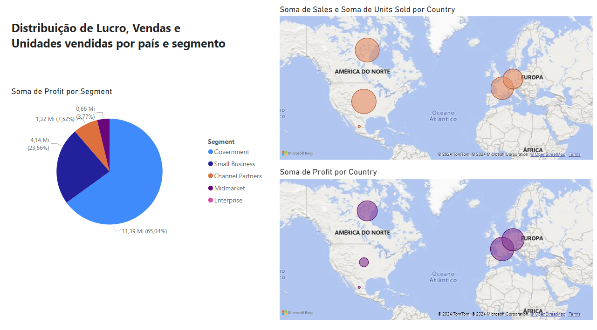

## Desafio #1 da DIO: Compreendendo o Desafio 🚀👩‍💻

**Descrição do Desafio:** 💡
O objetivo deste desafio é replicar duas páginas previamente desenvolvidas durante o curso, utilizando a amostra fornecida.

### Página 1 Recriada 📊
A primeira página deve apresentar os seguintes elementos:
- **Título do Relatório:** Deve ser claro e refletir o conteúdo da página.
- **Filtro por Ano e Mês:** 📅 Permitir que os usuários filtrem os dados conforme necessário.
- **Gráfico de Vendas por Produto:** 📈 Exibir a soma total de vendas para cada produto.
- **Gráfico do Preço Médio de Venda por Produto:** 💲 Mostrar o preço médio de venda, proporcionando insights sobre a estratégia de precificação.
- **Gráfico de Vendas por Ano, Mês e Segmento:** 📆 Oferecer uma visão detalhada das vendas, segmentadas por tempo e categoria.

!Descrição da Imagem

### Página 2 Recriada 📉
A segunda página deve incluir:
- **Título do Relatório:** Assim como na primeira página, o título deve ser descritivo.
- **Cards de Sumário de Vendas:** 💳 Apresentar a soma das vendas e das unidades vendidas de forma destacada.
- **Gráfico de Lucro por País:** 🌍 Ilustrar a soma do lucro gerado em diferentes países.
- **Gráfico de Lucro por Ano e Mês:** 🗓️ Analisar a evolução do lucro ao longo do tempo.
- **Gráfico de Vendas por País:** 🏆 Exibir a distribuição geográfica das vendas.

!Descrição da Imagem

A terceira página, a qual vocês irão criar sozinhos, deve conter alguns visuais. Esse desafio visa treinar a habilidade de criação de visuais. Assim, você poderá criar familiaridade com esses recursos. Em módulos mais avançados iremos tratar do layout mais elaborado dos nossos relatórios.  

Muito bem, a terceira página é composta por: 

*   Visual mapa 1: Soma de sales e unidades vendidas por país 

*   Visual mapa 2: Soma de lucro (profit) por país 

*   Visual de pizza: Lucro por segmento 

Além disso: 

*   Verifique a disposição dos visuais no relatório 

*   Modifique os nomes dos visuais para algo mais claro e direto (de acordo com o contexto) 

*   Preste atenção aos campos que são utilizados como dicas de ferramentas  

*   Publique o relatório 

*   Compartilhe como suplemento no Power Point 

*   Caso não tenha Power Point, salve o projeto de Power BI  

